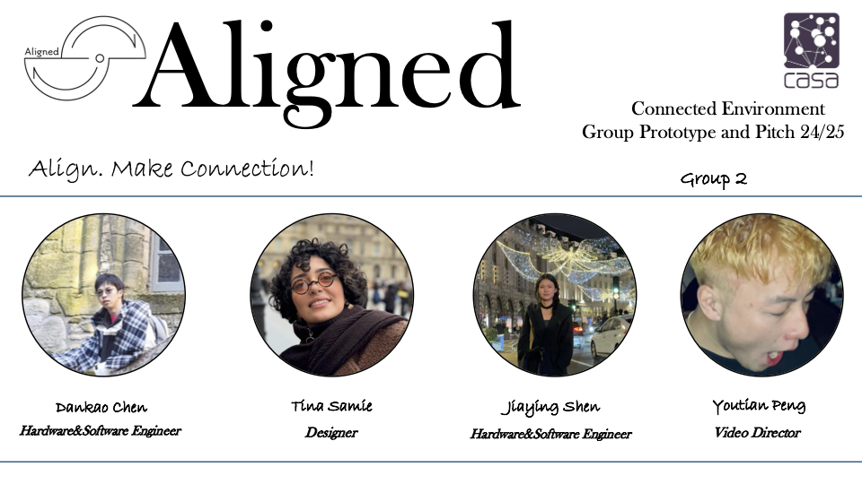
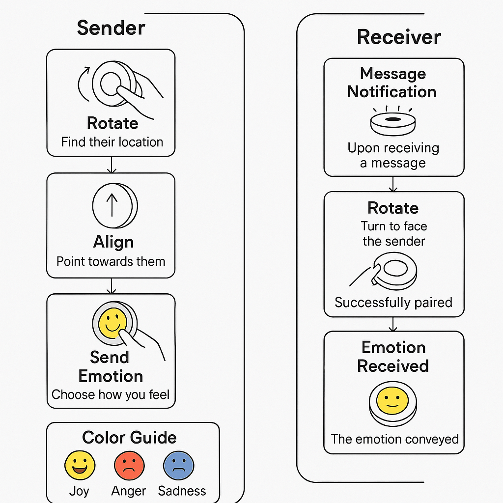
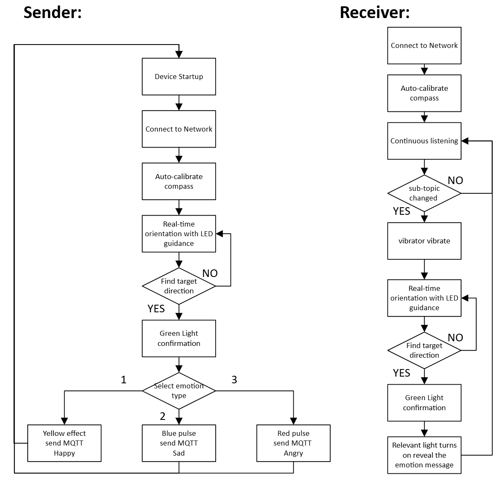
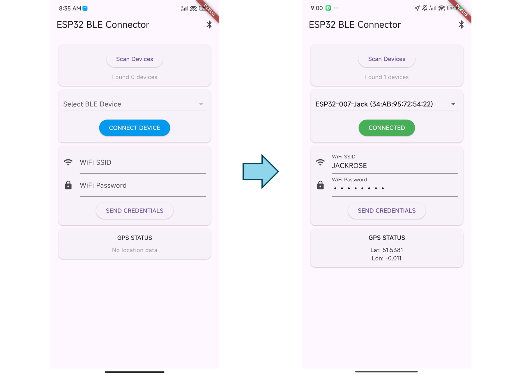
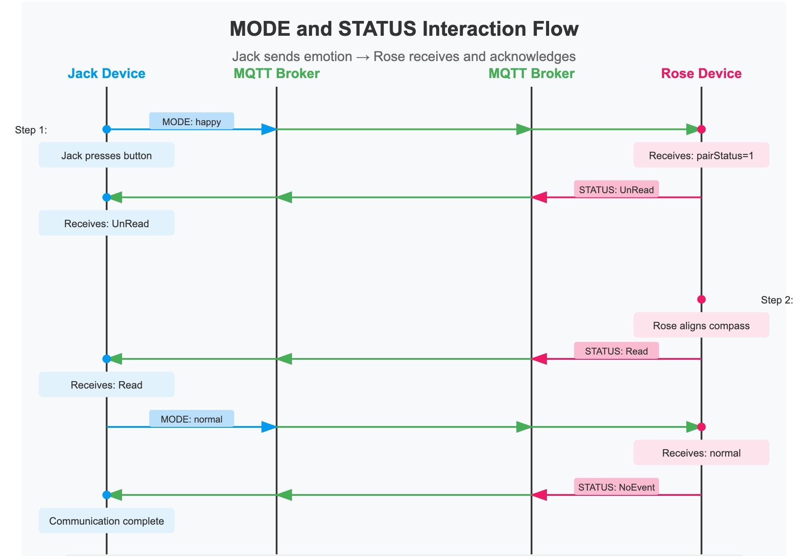
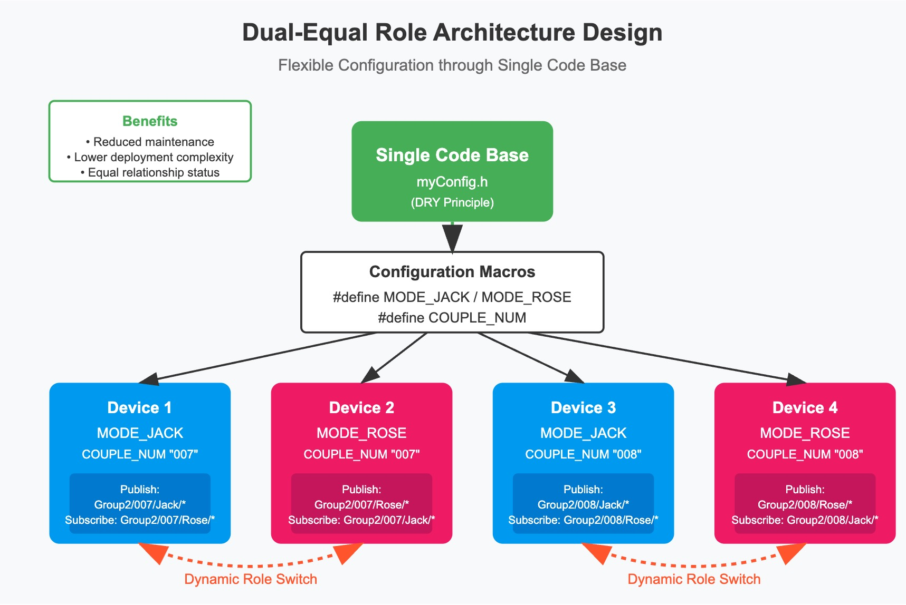
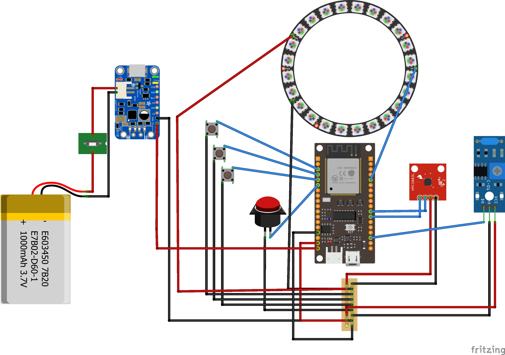
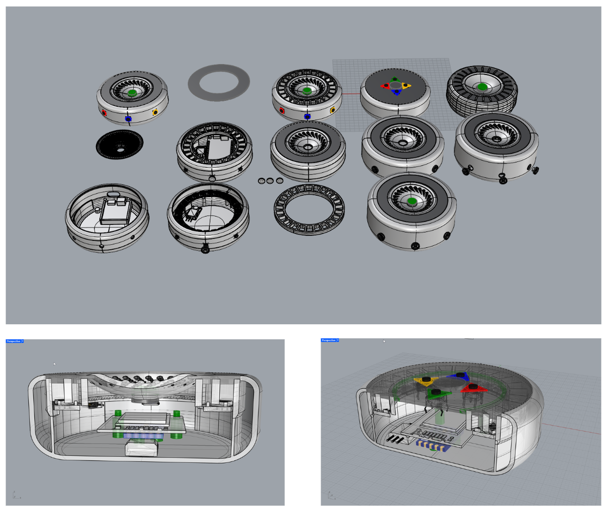

# CASA0021: Group Prototype and Pitch 24/25


<div style="text-align: center;">
  
</div>


## 📌 Introduction

**Aligned** is a paired emotional communication device for people in long-distance relationships—whether romantic partners, family, or close friends. Instead of relying on texts or video calls, users connect by physically aligning their devices and sending emotions through light and vibration.

When one user rotates their device to face the direction of their partner and presses a button, a message is sent—but it will only be received when the other user also aligns in return. This two-way interaction adds a sense of presence and emotional balance that typical communication tools often lack.

**Aligned isn’t just a compass—it’s your emotional North Star.**

## 🌍 Why Aligned?

Staying connected across distances can be emotionally draining. Traditional tools like messaging and video calls are often screen-heavy, verbal, and fatiguing.

**Aligned** takes a different approach. It brings back the power of non-verbal connection—through direction, movement, and shared moments. Inspired by studies on the importance of physical cues in emotional bonding, Aligned helps users feel close, quietly and intentionally.


----

## 🎬 Demo Video

See how **Aligned** works in action:  
[▶️ Watch the short demo on YouTube](https://www.youtube.com/watch?v=aNNHWGniDm8)


---

## 🧭 How to Use Aligned

<table>
  <tr>
    <td align="center">
      
    </td>
    <td align="center">
      
    </td>
  </tr>
</table>


### Step 1: Power on the device  
Press the big start button. The device will automatically calibrate the built-in compass. 

### Step 2: Init the Product with our APP

On first use, you’ll be prompted to connect to your own Wi-Fi using your phone. 

<p align="center">
  
</p>

### Step 3: Enjoy Our "Alinged"


#### 💌 If you are the **Sender**:

1. **Rotate to find direction**  
   The device will help you locate the correct direction of your paired partner.  
   Once you are aligned, the LEDs will signal success.

2. **Choose how you feel**  
   Use the emotion buttons to send a feeling:
   - 🟡 Yellow → Happy  
   - 🔵 Blue → Sad  
   - 🔴 Red → Angry  

3. That’s it — your emotion is sent.  
   The other person can now receive it, but **only when they align with your direction**.

---

#### 📡 If you are the **Receiver**:

1. **Wait for a message**  
   When your partner sends a signal, your device enters **Seek Mode**. The LED ring starts showing **navigation indicators** to help you rotate and align:
   - 🟢 **Green navigation lights** → You’re pointing in the correct direction  
   - 🔴 **Red navigation lights** → You're off-target. Try turning in the opposite direction
   
2. Once aligned, the navigation lights will disappear, and the ring will glow in an **emotion color**—Yellow, Blue, or Red—depending on the feeling your partner sent.


---

#### 🛠️ Color Guide (LED Ring)

| Emotion | Color |
|---------|--------|
| 😊 Happy | 🟡 Yellow |
| 😢 Sad   | 🔵 Blue   |
| 😠 Angry | 🔴 Red    |

---
### Precautions for use

To ensure optimal performance and longevity of your Aligned device, please observe the following precautions:

**Environmental Considerations**

- Do not place the device near strong magnetic fields as this may affect compass accuracy
- Ensure the device has sufficient space around it during rotation for accurate direction finding

**Battery and Power**
- Use only the provided USB cable for charging
- Do not charge the device while it is in use
- If the battery is completely depleted, charge for at least 10 minutes before attempting to power on

**Operational Safety**
- Do not disassemble or modify the device
- Keep the device away from children under 12 years old
- If the device becomes hot during use, turn it off immediately and allow it to cool

**Connectivity and Privacy**
- Ensure your Wi-Fi network has a stable internet connection
- Location permissions are only required during initial setup
- All emotional data is encrypted during transmission

**Maintenance**
- Keep the device away from water and excessive humidity
- Store the device in a cool, dry place when not in use
- Contact customer support if persistent issues occur

---
## Technical Architecture
### Software Design

The software architecture of the Aligned system is composed of two primary parts: the Android mobile application built using Flutter, and the firmware running on the ESP32 microcontroller via the Arduino platform. Together, these components enable seamless device initialization, connectivity, and core functionality.

#### Mobile Application (Flutter-based App)

The mobile application serves as the initial setup interface for the Aligned device, providing essential configuration data through Bluetooth Low Energy (BLE) connectivity.

The application establishes a connection using the service **UUID 0000ff01-0000-1000-8000-00805f9b34fb** and transmits data over two feature channels: the **WiFi credentials channel (UUID: 0000ff03-0000-1000-8000-00805f9b34fb)** is used to send the WiFi SSID and password, and the **GPS coordinates channel (UUID: 0000ff02-0000-1000-8000-00805f9b34fb)** is used to transmit location information. The app automatically obtains accurate location information from the phone's built-in GPS module and formats all the data into structured strings, such as SSID:xxx,PASS:xxx and LAT:xx.xxx,LON:xx.xxx, using UTF-8 encoding to ensure that the characters are transmitted correctly.

#### ESP32 Firmware (Arduino-based)

During the runtime phase, the device has multiple operating states: in normal mode, the device is idle and listens for messages; in seek mode, the user must align the device in the right direction to receive a message; in emotion send mode, the user rotates the device to find the direction of the partner and sends the emotion; and in message read mode, the device provides feedback when the direction is aligned.

<p align="center">
  
</p>

The Arduino firmware for this project adopts an innovative dual-equal role architecture design, where the device roles can be interchanged at any time; the sender and receiver are not fixed identities but are switched dynamically according to the current interaction needs. The firmware also achieves flexible configuration of multiple pairs of users and dual devices through a single code base, greatly reducing the maintenance cost and deployment complexity of the firmware. 

<p align="center">
  
</p>

By defining MODE\_JACK/MODE\_ROSE and COUPLE\_NUM macros in the header file, the system is able to automatically configure the corresponding device name and MQTT topic subscription publishing relationship without writing duplicate code. 


### Hardware Design
<p align="center">
  
</p>


| Component                 | Description                                           |
|--------------------------|-------------------------------------------------------|
| ESP8266          | Main MCU, handles logic and communication |
| NeoPixel Ring         | RGB LED ring for visual feedback|
| Push Buttons             | Three small tactile buttons for user input            |
| Big Red Button           | Primary start button             |
| Switch Button          | Control power on or off             |
| HMC5883L                 | 3-axis digital compass for direction sensing          |
| USB battery Module            | LiPo battery charging and protection module           |
| LiPo Battery (3.7V, 1000mAh) | Portable power source for the entire system      |
| vibration | Provide hearable and touchable effect                |
| MOSFET |  Provide higher power for vibration|


    pin4    --- button1(sad)
    pin18   --- button2(happy)
    pin19   --- button3(angry)
    pin23   --- start button4
    pin16   --- Motor
    pin2    --- LED ring
    D22     --- SCL
    D21     --- SDA
    VCC     --- 3.3V 
    GND     --- GND


----

### Reproducing the Enclosure & 3DPrint 

Aligned with the project's theme, the device was aimed to be carried by the user as a small, handheld device. In this regard, one of the main aspects of this project was the enclosure's design. The design of the enclosure follows three primary principles:

1. **Compact and Portable:** Designed to be small and pocket-sized for comfortable handheld use, the device's wireless capabilities ensure convenience and ease of transport.
2. **User-Friendly:** Intuitive operation is paramount, with straightforward usage and clear, easily interpretable signs and colors.
3. **Aesthetic Appeal:** A visually pleasing design that is sleek and customizable to suit individual preferences.

<p align="center">
  
</p>

## How to Dowload the files

### 3D model

You can find different versions of the model in the 3D model folder. Most of the modeling was done in Rhino 8, therefore the best platform to open this file is using Rhino, however the files could be imported to anyother modleing software that compatible with the file format. The G-code for the 3d printing is also available with the settings included in the name. 
There is also another file for lasercutting the top LED ring diffuser from a 3mm black acrylic sheet and the buttons with respective colours for each emotion. 

<p align="center">
  
</p>
The device's compact size presented numerous challenges for designing the enclosure. Some of the challenges overcome in the prototyping process were efficiently arranging all components, including the battery with its charger module, in a small space and ensuring that all components were accessible. 

### Arduino

The root is ```/main-Program/main_program_GPP_combine_v4```

### Flutter

The root is ```/flutter_app```


## Reference:

1. [https://github.com/troelssiggaard/ESP32-fritzing-module](https://forum.fritzing.org/t/esp-wroom-32d-firebeetle/13869/5)

2. https://github.com/adafruit/Fritzing-Library/blob/master/parts/retired/Neopixel%2024%20Ring.fzpz

