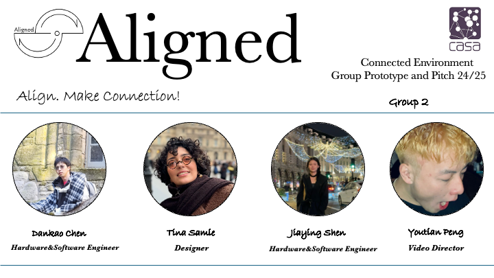
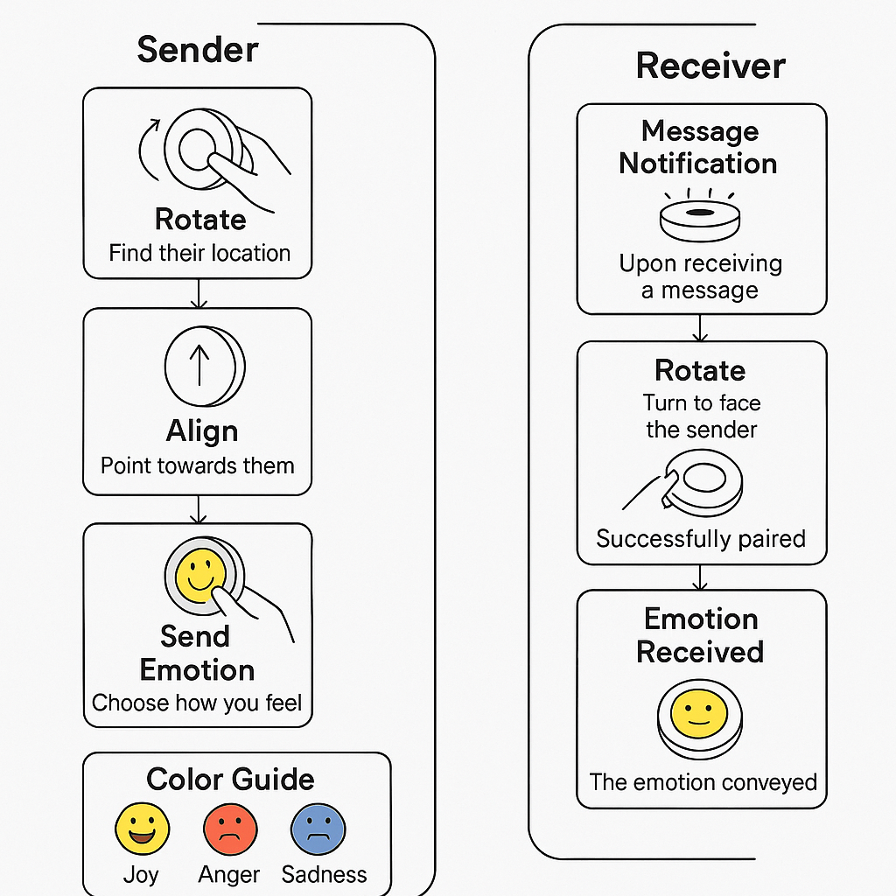

# CASA0021: Group Prototype and Pitch 24/25

  

## 📌 Introduction

**Aligned** is a paired emotional communication device for people in long-distance relationships—whether romantic partners, family, or close friends. Instead of relying on texts or video calls, users connect by physically aligning their devices and sending emotions through light and vibration.

When one user rotates their device to face the direction of their partner and presses a button, a message is sent—but it will only be received when the other user also aligns in return. This two-way interaction adds a sense of presence and emotional balance that typical communication tools often lack.

**Aligned isn’t just a compass—it’s your emotional North Star.**

## 🌍 Why Aligned?

Staying connected across distances can be emotionally draining. Traditional tools like messaging and video calls are often screen-heavy, verbal, and fatiguing.

**Aligned** takes a different approach. It brings back the power of non-verbal connection—through direction, movement, and shared moments. Inspired by studies on the importance of physical cues in emotional bonding, Aligned helps users feel close, quietly and intentionally.

---- 

## 🎬 Demo Video

See how **Aligned** works in action:  
[▶️ Watch the short demo on YouTube](https://www.youtube.com/watch?v=aNNHWGniDm8)

---

## 🧭 How to Use Aligned

<table>
  <tr>
    <td align="center">
      
    </td>
    <td align="center">
      
    </td>
  </tr>
</table>

### Step 1: Power on the device  
Press the big red start button. On first use, you’ll be prompted to connect to Wi-Fi using your phone. The device will automatically calibrate the built-in compass.

---

### 💌 If you are the **Sender**:

1. **Rotate to find direction**  
   The device will help you locate the correct direction of your paired partner.  
   Once you are aligned, the LEDs will signal success.

2. **Choose how you feel**  
   Use the emotion buttons to send a feeling:
   - 🟡 Yellow → Happy  
   - 🔵 Blue → Sad  
   - 🔴 Red → Angry  

3. That’s it — your emotion is sent.  
   The other person can now receive it, but **only when they align with your direction**.

---

### 📡 If you are the **Receiver**:

1. **Wait for a message**  
   When your partner sends a signal, your device enters **Seek Mode**. The LED ring starts showing **navigation indicators** to help you rotate and align:

   - 🟢 **Green navigation lights** → You’re pointing in the correct direction  
   - 🔴 **Red navigation lights** → You're off-target. Try turning in the opposite direction

2. Once aligned, the navigation lights will disappear, and the ring will glow in an **emotion color**—Yellow, Blue, or Red—depending on the feeling your partner sent.

---

### 🛠️ Color Guide (LED Ring)

| Emotion | Color |
|---------|--------|
| 😊 Happy | 🟡 Yellow |
| 😢 Sad   | 🔵 Blue   |
| 😠 Angry | 🔴 Red    |

--- 
## Technical Architecture
### Software Design

### Hardware Design

  

| Component                 | Description                                           |
|--------------------------|-------------------------------------------------------|
| ESP8266          | Main MCU, handles logic and communication |
| NeoPixel Ring         | RGB LED ring for visual feedback|
| Push Buttons             | Three small tactile buttons for user input            |
| Big Red Button           | Primary start button             |
| Switch Button          | Control power on or off             |
| HMC5883L                 | 3-axis digital compass for direction sensing          |
| USB battery Module            | LiPo battery charging and protection module           |
| LiPo Battery (3.7V, 1000mAh) | Portable power source for the entire system      |
| vibration | Provide hearable and touchable effect                |
| MOSFET |  Provide higher power for vibration|

    pin4    --- button1(sad)
    pin18   --- button2(happy)
    pin19   --- button3(angry)
    pin23   --- start button4
    pin16   --- Motor
    pin2    --- LED ring
    D22     --- SCL
    D21     --- SDA
    VCC     --- 3.3V 
    GND     --- GND

***

----

### Enclosure Design

## Reference:

1. [https://github.com/troelssiggaard/ESP32-fritzing-module](https://forum.fritzing.org/t/esp-wroom-32d-firebeetle/13869/5)

2. https://github.com/adafruit/Fritzing-Library/blob/master/parts/retired/Neopixel%2024%20Ring.fzpz

